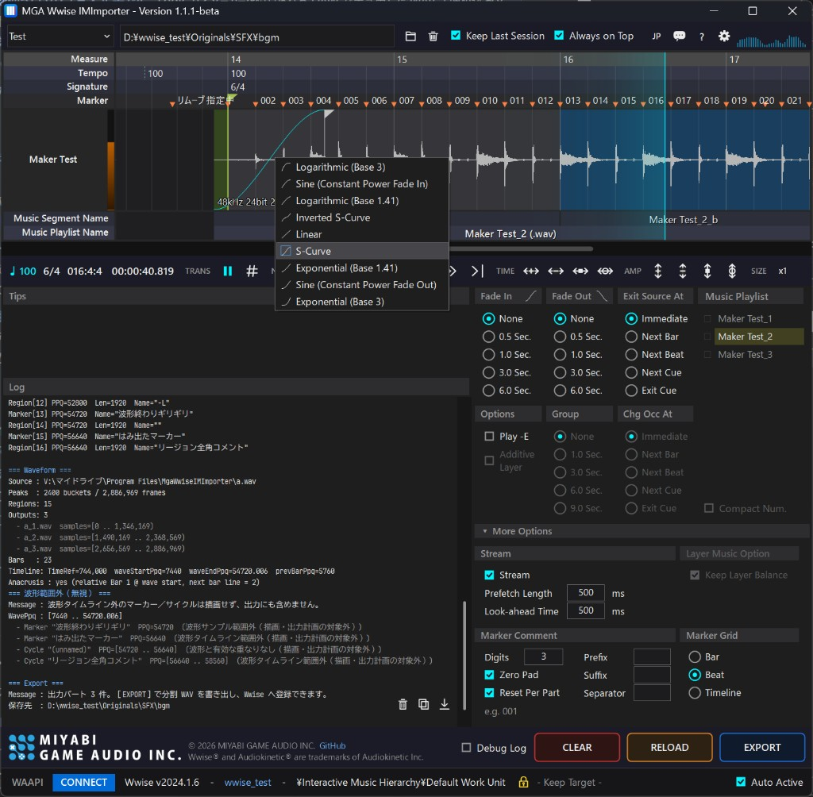
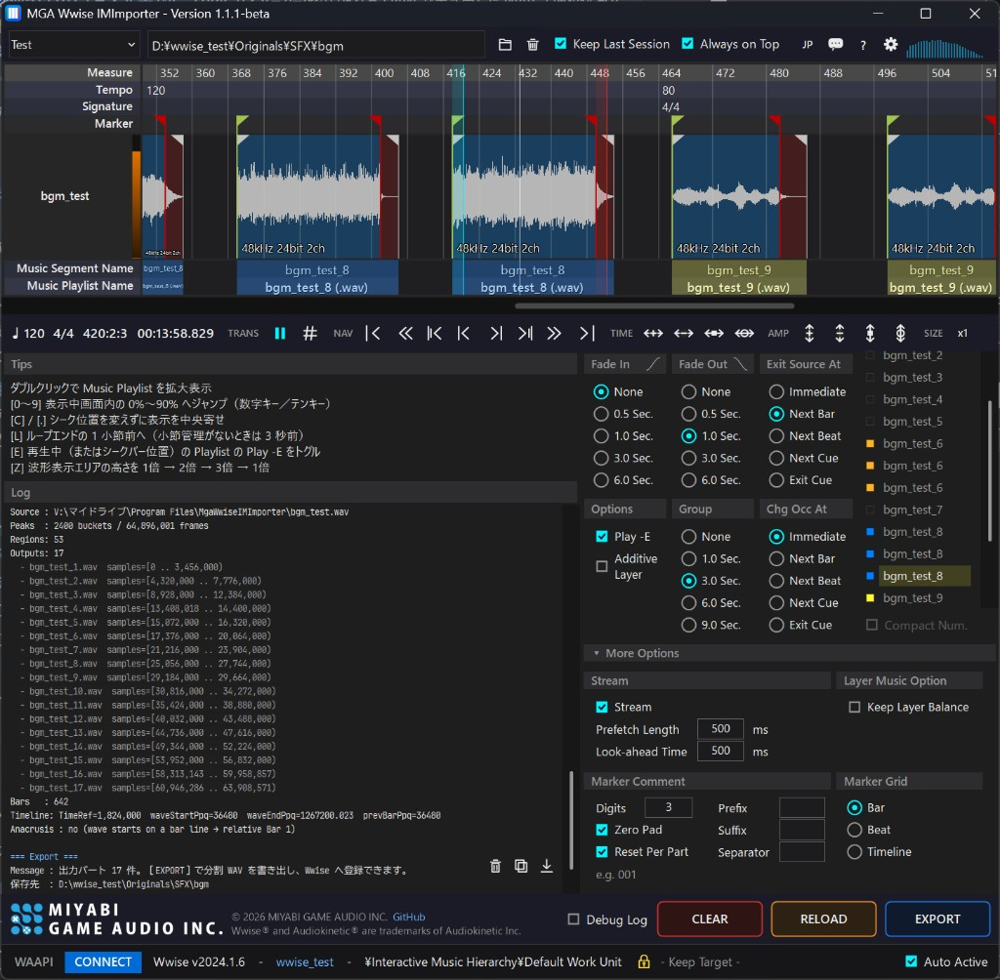

# MGA Wwise IM Importer

[日本語](README.md)

Take Interactive Music from “hand-built Authoring” to “listen, decide, and deliver.”

  
  

## What makes this app stand out

**Carry the music structure you designed in the DAW straight into Wwise Interactive Music.**

Interactive Music in Wwise involves many building blocks — containers, transitions, cues, fades — and assembling them by hand takes time. With this app, you decide transitions and layers by ear on the waveform, then push a consistent Wwise structure with a single EXPORT. **Far faster than hand-building the same graph.**

**You do not need Nuendo / Cubase.** A WAV with markers from Logic or another DAW that can place markers already saves a lot of work. This app can also add markers and move loop-marker pairs itself—so **a dedicated waveform editor is often unnecessary**. With layered music, no matter how many layers you have, you only need to work the loop points on one layer — the edits carry over to the other layers automatically.

**With Nuendo / Cubase, it is especially powerful.** Export a marker-track XML and you get the most out of tempo, bar, and time-signature data. Markers and cycles can be placed on the waveform as if painting them on, so Entry / Exit / loop design stays visual.

**Horizontal and vertical transitions can be mixed freely.** Interactive music transitions come in two directions: the crossfade type (horizontal — switching from one piece to another) and the layered type (vertical). The vertical kind further splits into layer switching — crossfading to another piece while keeping the playback position — and additive layering, which stacks extra parts on top of what is already playing. Even when these assets coexist in one project, you can preview their transitions together, with no distinction between them, and implement them into Wwise in one pass.

The workflow assumes **the Interactive Music data in Wwise is the master**. Keep one-shot and loop material on a single master waveform instead of pre-separating files; build structure nondestructively, then EXPORT cut ranges plus Wwise properties (MusicClip Fade / MusicFade / Make-Up Gain / Cue, and so on). Gains and fades are not baked into the source WAV.

**Implementation combines WAAPI with the app's own processing.** On top of remote-controlling Wwise through WAAPI, the app handles WAV cutting, loudness measurement, fade-to-property conversion, and more in its own processing — going further than auto-implementation tools that only call WAAPI. Concretely, you can:

- Preview transitions between Music Playlists by ear while switching Exit Source At / Fade In / Fade Out / Play -E
- Group playlists into vertical layers and check layer switching with additive-layer playback, Group Fade, and Change Occurs At
- **Implement groups with their volume balance preserved** (automatically compensates, via Make-Up Gain, the layer balance that Loudness Normalization would otherwise destroy; recommended when using it)
- Set easy-to-forget streaming options (Prefetch Length / Look-ahead Time) from the UI and have them written out
- Have everything you decided by ear generated automatically as a Music hierarchy in Wwise over WAAPI
- **Drop multiple waves at once, or use marker-track XML, to implement any number of pieces together**

## Manual & download

- Manual: [Japanese](https://mga-ueda.github.io/MGA-Wwise-IM-Importer/manual.ja.html) · [English](https://mga-ueda.github.io/MGA-Wwise-IM-Importer/manual.en.html) · [Hub](https://mga-ueda.github.io/MGA-Wwise-IM-Importer/)
- New here? Start with the [quick start](https://mga-ueda.github.io/MGA-Wwise-IM-Importer/manual.en.html#quickstart) (a single WAV is enough) and [preparing your material](https://mga-ueda.github.io/MGA-Wwise-IM-Importer/manual.en.html#prepare) (XML and marker rules)
- In-app: project-bar **Manual (`?`)** (left of the gear; follows JP/EN)
- Builds: [Releases](https://github.com/mga-ueda/MGA-Wwise-IM-Importer/releases)

Wwise® / Audiokinetic® and Nuendo® / Cubase® / Steinberg® are trademarks of their respective owners. This tool is unofficial.
